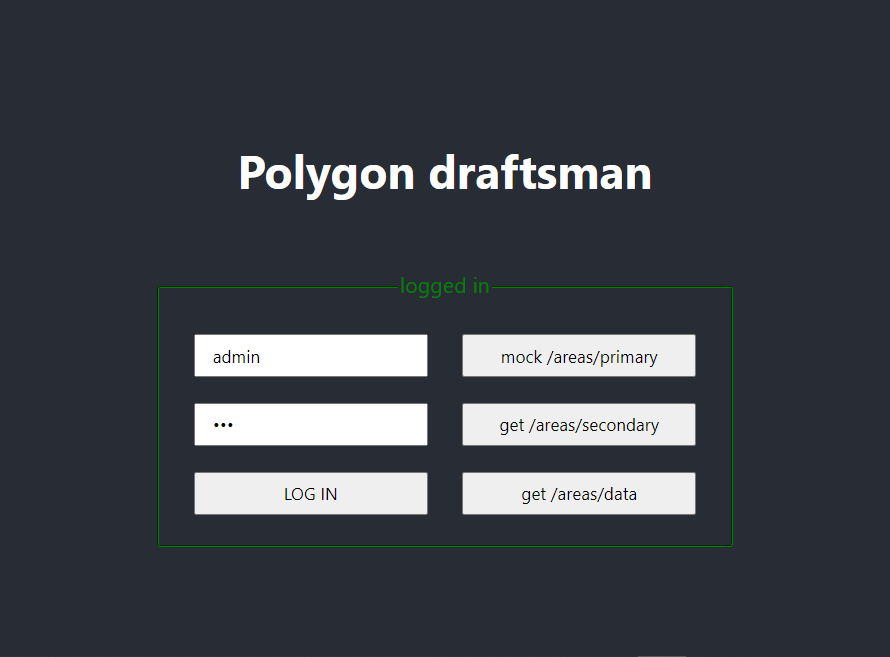
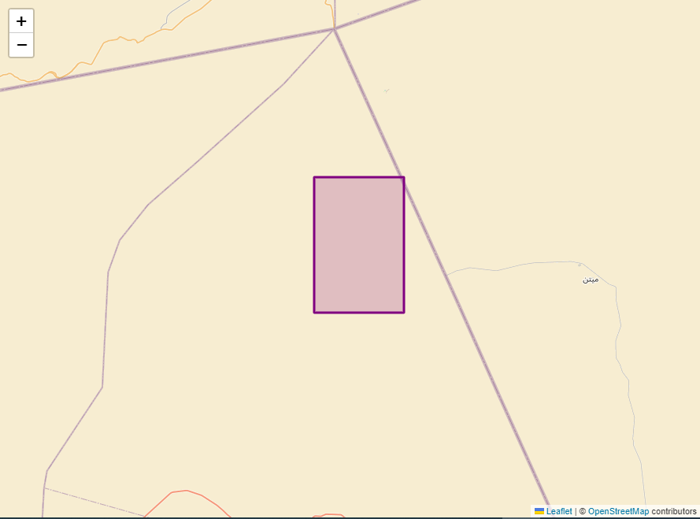
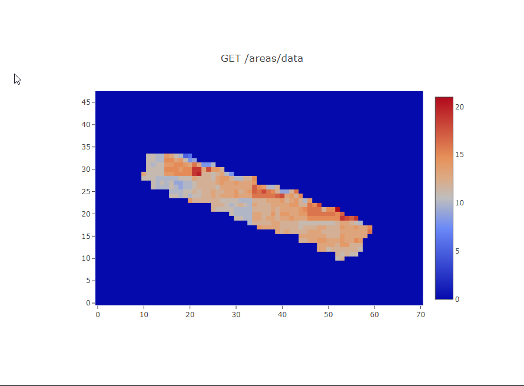

# Polygon draftsman

## Setup instructions

Clone repository, go to directory and install dependencies:\
  `npm install / yarn install`

To run app in development mode execute:\
`npm start / yarn start`

Runs the app in the development mode.\
Open [_http://localhost:3000_](http://localhost:3000) to view it in the browser.

Deployed version is available here:\
_https://mcesarczyk.github.io/polygon-draftsman-mcesarczyk/_

***

## Using app

On first page log in with proper credentials:

It enables essential functions of application.

First two functions helps to render geographical coordinates on map thanks to Leaflet library based on OpenStreetMaps.

Last button runs Plotly heatmap and allows rendering geotiff data:

